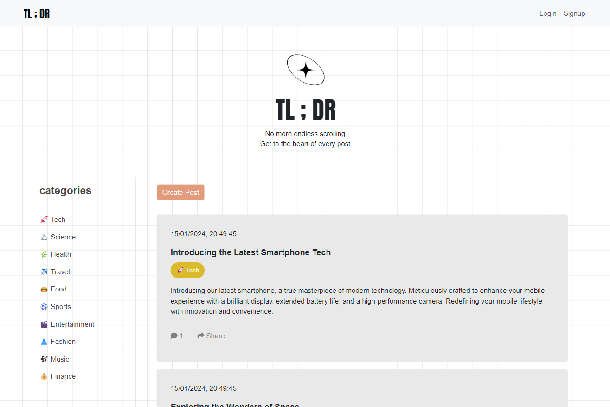

# TL-DR

## Description

Tl-DR is intended as a reddit-style forum where users can make posts, comment on posts and create categories. The defining feature of TL-DR is the integration of openai to generate summaries of user posts which are then viewable on the homepage and categories pages to provide a snapshot of the post content. 

TL-DR is built on a MERN stack with hosting provided by heroku.

## Tech-stack

- Mongoose
- Express
- React
- Nodejs
- Bcrypt
- Axios
- Graphql
- Apollo 
- Jsonwebtoken

## Screenshot

## Deployed Site

https://tl-dr-00224c165de8.herokuapp.com/

## Contributors

Carol Kim, Thorsten Beowulf, Michael King

## Licence

Reproduction of this repository is under an MIT licence.
